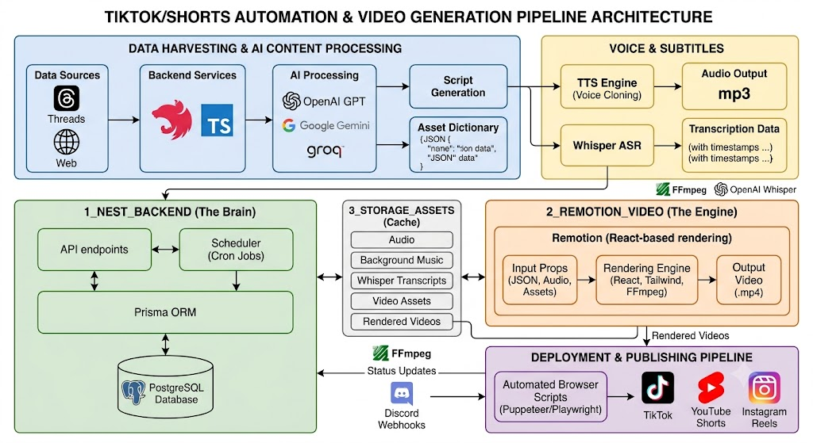

# 🤖 TikTok/Shorts Automation & Video Generation Pipeline


## Table of Contents
- [Overview](#overview)
- [Architecture & Project Structure](#architecture--project-structure)
- [Detailed Features & Workflow Pipeline](#detailed-features--workflow-pipeline)
- [API Documentation](#api-documentation)
- [Getting Started](#getting-started)
  - [1. Standard Setup](#1-standard-setup)
  - [2. Docker Setup (Recommended)](#2-docker-setup-recommended)
- [Tech Stack](#tech-stack)
- [Contributing](#contributing)
- [Future Improvements](#future-improvements)
- [License](#license)

---

## Overview
This project is an advanced, fully automated pipeline designed for generating, rendering, and publishing short-form videos (TikToks, YouTube Shorts, Instagram Reels). It seamlessly integrates data scraping, AI-powered content curation (OpenAI, Gemini), Text-to-Speech (TTS), precise audio transcription (Whisper), and programmatic video rendering using Remotion.

The system is built to operate hands-free: it hunts for trending topics, writes the scripts, generates the media, renders the video, and uploads it directly to social media platforms.

---

## Architecture & Project Structure



The project is structured as a monorepo containing three main components:

```text
├── 1_nest_backend/      # The Brain: NestJS API, Cron Jobs, Prisma, AI Logic & Automation
├── 2_Remotion_Video/    # The Engine: React, Remotion templates, Tailwind CSS for video rendering
├── 3_Storage_Assets/    # The Cache: Temp MP3s, Whisper JSONs, and final output videos (.mp4)
├── .github/             # CI/CD Workflows & Issue Templates
└── docker-compose.yml   # Deployment configuration

```

---

## Detailed Features & Workflow Pipeline

The automation follows a strict, multi-step pipeline triggered by backend workers:

### 1. Data Harvesting (Watcher & Auto-Hunter)

* Automated background services scrape trending topics, dramatic stories, or serious discussions from platforms like Threads.
* Dedicated workflow modules handle different content types (e.g., `threads-drama`, `threads-compilation`, `threads-serious`, `tiktok-lyrics`).

### 2. AI Content Processing (AI Module)

* Integrates multiple LLM providers (OpenAI, Google Gemini, Groq) to process and rewrite raw scraped content into engaging, retention-optimized video scripts.
* The AI dynamically selects appropriate visual assets (memes) and sound effects (SFX) based on the context, using predefined references (`meme_dictionary.json` and `sfx_dictionary.json`).

### 3. Voice & Subtitles (TTS & Whisper)

* Converts the AI-generated script into natural-sounding voiceovers using Text-to-Speech (TTS) engines.
* Passes the generated audio through Whisper (OpenAI) to extract highly accurate, word-level timestamps. This data is saved as JSON/SRT files to synchronize dynamic text animations in the video.

### 4. Programmatic Video Rendering (Remotion Runner)

The backend triggers the Remotion CLI, injecting the generated audio, timestamps, and script data as React props.
**Dynamic Compositions Supported:**

* **Threads Format:** Visualizes social media posts with typing/reading animations and meme pop-ups.
* **Serious/B-roll Format:** Features cinematic text, neon backgrounds, and engaging B-roll footage.
* **TikTok Lyrics:** Trendy, aesthetic music-lyric visualizers.
* *Automatically applies background music (BGM), synchronized sound effects (SFX), and visual transitions.*

### 5. Automated Publishing (TikTok Upload & Discord Notification)

* Utilizes automated browser scripts to handle the complex process of uploading the final `.mp4` directly to TikTok, complete with auto-generated captions and hashtags.
* Sends real-time workflow logs, error reports, and success notifications to a designated Discord channel via Webhooks.

---

## API Documentation

This project includes a fully documented API using **Swagger UI**.
Once the backend is running, navigate to:

```text
http://localhost:3000/api/docs

```

Here you can view all endpoints, test scraping workflows, and trigger manual video generation.

---

## Getting Started

### Prerequisites

* Node.js (v18 or v20 LTS recommended)
* **FFmpeg** (Crucial: Must be installed and added to your system's PATH. Both Remotion and Whisper rely on it for media processing).
* Git
* Docker & Docker Compose (Optional but recommended for deployment)

### 1. Standard Setup

**Backend Setup (`1_nest_backend`)**

```bash
cd 1_nest_backend
npm install

```

Create a `.env` file in the `1_nest_backend` directory and configure your keys:

```env
# Database
DATABASE_URL="file:./prisma/dev.db" # Or your PostgreSQL connection string

# AI Providers
OPENAI_API_KEY="your_openai_key_here"
GEMINI_API_KEY="your_gemini_key_here"
GROQ_API_KEY="your_groq_key_here"

# Notifications
DISCORD_WEBHOOK_URL="your_discord_webhook_url"

```

Initialize the Prisma database and start the server:

```bash
npx prisma db push
npm run start:dev

```

**Video Renderer Setup (`2_Remotion_Video`)**
Open a new terminal window:

```bash
cd 2_Remotion_Video
npm install
npm start # Launch Remotion Studio to preview templates

```

### 2. Docker Setup (Recommended)

To run the entire backend and database environment without installing dependencies locally:

```bash
docker-compose up -d --build

```

*Note: FFmpeg is already pre-configured inside the Docker container.*

---

## Tech Stack

* **Core Backend:** NestJS, TypeScript, Prisma ORM.
* **Video Generation:** Remotion, React, Tailwind CSS.
* **AI & ML:** OpenAI API, Google Gemini, Groq, Whisper.
* **Automation:** Puppeteer / Playwright, FFmpeg.
* **Deployment:** Docker, GitHub Actions (CI/CD).

---

## Contributing

Contributions, issues, and feature requests are welcome!

1. Fork the repo.
2. Create your feature branch (`git checkout -b feature/AmazingFeature`).
3. Commit your changes (`git commit -m 'Add some AmazingFeature'`).
4. Push to the branch (`git push origin feature/AmazingFeature`).
5. Open a Pull Request.

Please make sure to update tests as appropriate.

---

## Future Improvements

* [ ] Build a frontend Dashboard to manage campaigns, templates, and view rendered videos manually.
* [ ] Expand auto-upload capabilities to YouTube Shorts and Instagram Reels APIs.
* [ ] Add multi-language generation support.
* [ ] Add Unit & E2E Testing coverage.

---

## License

This project is licensed under the MIT License - see the [LICENSE](https://www.google.com/search?q=LICENSE) file for details.

```

```
